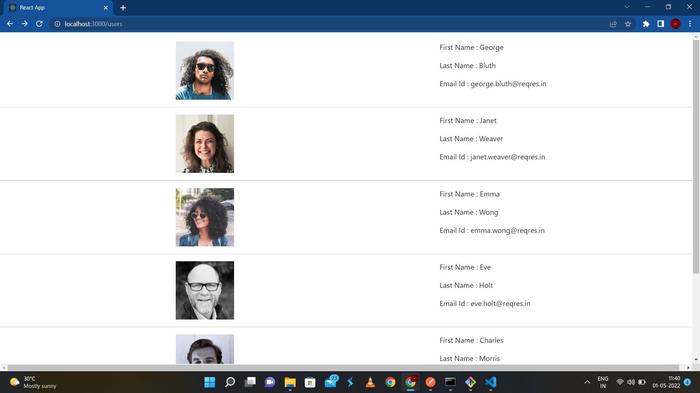
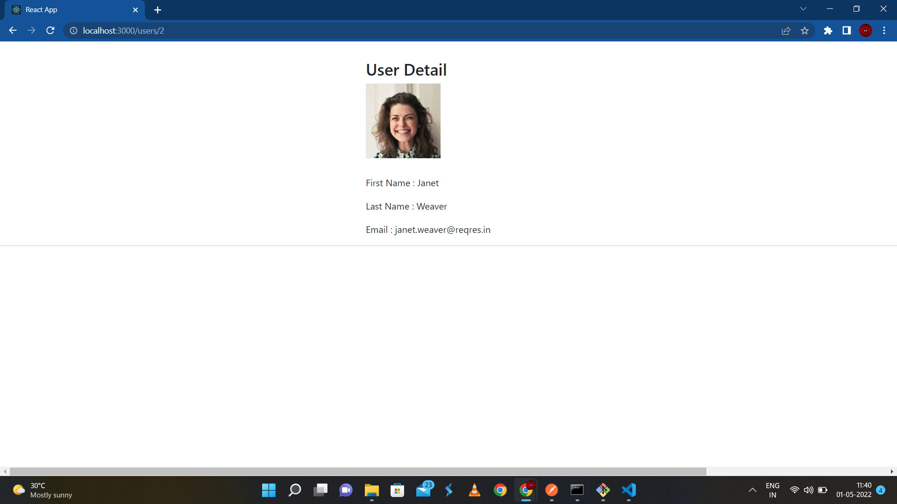

<h3>Task Completed</h3>
 Output : 
 
 
 
 Packages added :
 <ul>
  <li>Axios</li>
  <li>react-router-dom</li>
  <li>Bootstrap</li>
 </ul>
 
 Tools Used :
  
 <ul>
  <li>Postman</li>
  <li>Vs code</li>
 </ul>
